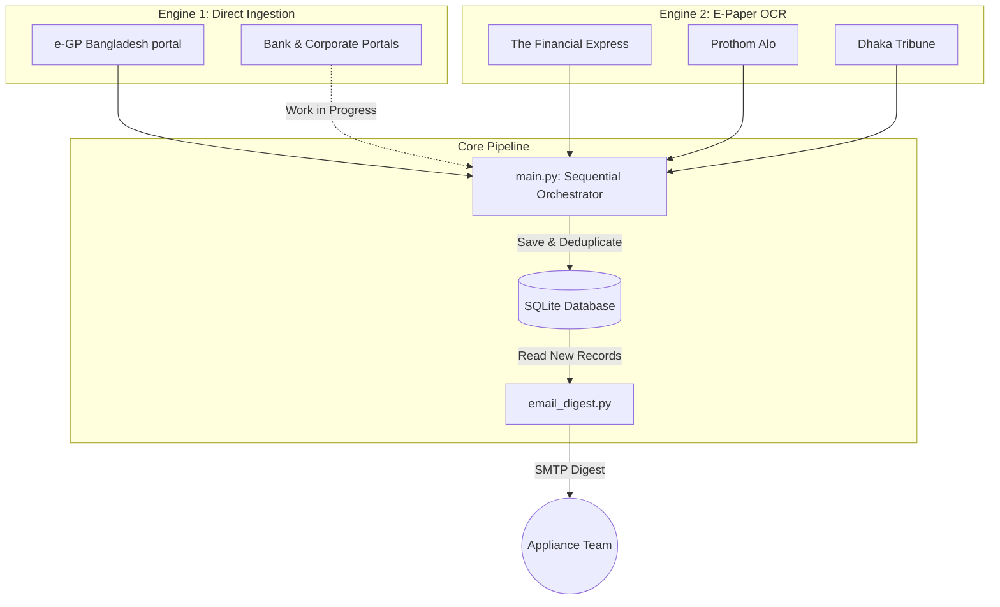

# 📡 Appliance Tender Intelligence System (ATIS)

[](https://www.python.org/)
[](https://sqlite.org/)
[](https://github.com/tesseract-ocr/tesseract)
[](https://www.crummy.com/software/BeautifulSoup/)

ATIS is a production-ready, dual-engine procurement intelligence pipeline designed to scrape, OCR, filter, and compile appliance procurement notices (Air Conditioners, TVs, Fans, Refrigerators, Washing Machines, etc.) across Bangladesh.

It captures tenders from both government sources (e-GP) and physical newspaper classifieds (E-Papers) using Tesseract OCR, matches them against bilingual keyword rules, and emails a categorized daily HTML digest.

---

## 🏗️ System Architecture



### File Structure & Components

```filepaths
tender-intel/
├── main.py                  # Sequential Phase Ingestion Orchestrator
├── requirements.txt         # Python project dependencies
├── test_fe_ocr.py           # Diagnostic script for The Financial Express OCR
├── test_pa_ocr.py           # Diagnostic script for Prothom Alo OCR
├── test_dt_ocr.py           # Diagnostic script for Dhaka Tribune OCR
├── config/
│   └── categories.yaml      # Bilingual appliance keywords & target registry
├── core/
│   ├── db.py                # Database connection, schemas, & migrations
│   ├── models.py            # Pydantic data schemas (TenderRecord)
│   └── settings.py          # Configuration & environment loader
├── data/
│   ├── epaper_cache/        # Caches raw page JPEG scans
│   └── tenders.db           # SQLite database
├── logs/
│   └── run.log              # Persistent operation execution logs
├── notifiers/
│   └── email_digest.py      # HTML digest builder with source badges & SMTP sender
└── scrapers/
    ├── __init__.py          # Active scrapers registry
    ├── base.py              # BaseScraper abstract base class
    ├── egp_scraper.py       # Bangladesh e-GP RSS & search servlet scraper
    ├── portal_scraper.py    # Engine 1 Bank/Corporate Portal scraper (dynamic/PDF)
    └── epaper_ocr/
        ├── financial_express.py  # English Financial Express OCR Scraper
        ├── prothom_alo.py        # Bilingual Bengali/English Prothom Alo OCR Scraper
        ├── dhaka_tribune.py      # English Dhaka Tribune OCR Scraper
        └── ocr_engine.py         # OpenCV pre-processing & Tesseract OCR pipeline
```

---

## 🚀 Setup & Installation

### 1. Install OS Dependencies
This project requires OpenCV libraries and Tesseract OCR with English and Bengali language packs:

**For Ubuntu/Debian:**
```bash
sudo apt update
sudo apt install -y tesseract-ocr tesseract-ocr-eng tesseract-ocr-ben libtesseract-dev
```

### 2. Set Up Virtual Environment & Dependencies
```bash
# Clone the repository
git clone https://github.com/shrabondas5544/Appliance-Tender-Intelligence.git
cd Appliance-Tender-Intelligence

# Create virtual environment
python3 -m venv venv
source venv/bin/activate

# Install requirements
pip install -r requirements.txt
```

### 3. Environment Configuration
Copy the template `.env` file and configure your SMTP mail credentials:
```bash
cp .env.example .env
```
Open `.env` and fill in your settings:
```ini
SMTP_HOST=smtp.gmail.com
SMTP_PORT=587
SMTP_USER=your_sender_gmail@gmail.com
SMTP_PASSWORD=your_app_specific_gmail_password
EMAIL_TO=recipient1@domain.com,recipient2@domain.com
```

---

## 💻 Running & Verification

The orchestrator executes all active scrapers in sequential phases for clean, structured progress logs.

### Run Standard Scan (Today's Date)
```bash
python3 main.py
```

### Run Simulated Scan (Specific Target Date)
To verify historical date scraping or run retrospective updates:
```bash
python3 main.py --now 16.08.2026
```

### Standalone OCR Diagnostics
To test and debug specific e-paper scrapers independently:
```bash
# Test The Financial Express OCR Engine
python3 test_fe_ocr.py

# Test Prothom Alo OCR Engine (Bilingual Bengali/English)
python3 test_pa_ocr.py

# Test Dhaka Tribune OCR Engine
python3 test_dt_ocr.py
```

---

## ⚙️ Customization (`categories.yaml`)

You can expand keywords or update e-paper targets directly in [config/categories.yaml](file:///home/user/Downloads/tender-intel/config/categories.yaml) without changing any code:

```yaml
# Add English and Bangla appliance keywords here
air_conditioner:
  - "air conditioner"
  - "split ac"
  - "এসি"
  - "এয়ার কন্ডিশনার"

# Target registration
epaper_targets:
  - name: "Prothom Alo"
    domain: "epaper.prothomalo.com"
    language: "BN"
    active: true
```

---

## 📅 Deployment & Automated Execution (GitHub Actions)

This project uses **GitHub Actions** for daily scheduled execution (6:00 AM BDT). Whenever you push new code or update `config/categories.yaml` on GitHub, the workflow automatically runs the updated code on schedule!

### 1. Configure GitHub Repository Secrets
Go to your GitHub repo -> **Settings -> Secrets and variables -> Actions** and add the following secrets:

* `SMTP_HOST`: `smtp.gmail.com`
* `SMTP_PORT`: `587`
* `SMTP_USERNAME`: `your_gmail_address`
* `SMTP_APP_PASSWORD`: `your_gmail_app_password`
* `EMAIL_FROM`: `your_gmail_address`
* `EMAIL_TO`: `recipient1@domain.com,recipient2@domain.com`

### 2. Automatic Updates
* On every scheduled run (00:00 UTC / 06:00 AM BDT), GitHub Actions clones the latest code, installs Tesseract OCR + Bangla data packs, runs `main.py`, and sends the HTML digest.
* The workflow commits the updated `data/tenders.db` back to `main` to preserve deduplication state across runs.
* You can also trigger manual runs anytime under **Actions -> Daily Tender Scan & Auto Digest -> Run workflow**.

