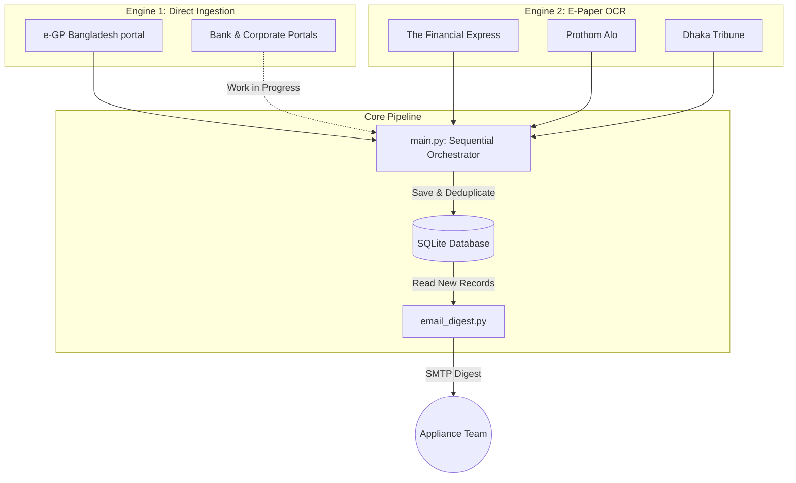

# 📡 Appliance Tender Intelligence System (ATIS)

[](https://www.python.org/)
[](https://sqlite.org/)
[](https://github.com/tesseract-ocr/tesseract)
[](https://www.crummy.com/software/BeautifulSoup/)

ATIS is a production-ready, dual-engine procurement intelligence pipeline designed to scrape, OCR, filter, and compile appliance procurement notices (Air Conditioners, TVs, Fans, Refrigerators, Washing Machines, etc.) across Bangladesh.

It captures tenders from both government sources (e-GP) and physical newspaper classifieds (E-Papers) using Tesseract OCR, matches them against bilingual keyword rules, and emails a categorized daily HTML digest.

---

## 🏗️ System Architecture



### File Structure & Components

```filepaths
tender-intel/
├── main.py                  # Sequential Phase Ingestion Orchestrator
├── requirements.txt         # Python project dependencies
├── test_fe_ocr.py           # Diagnostic script for The Financial Express OCR
├── test_pa_ocr.py           # Diagnostic script for Prothom Alo OCR
├── test_dt_ocr.py           # Diagnostic script for Dhaka Tribune OCR
├── config/
│   └── categories.yaml      # Bilingual appliance keywords & target registry
├── core/
│   ├── db.py                # Database connection, schemas, & migrations
│   ├── models.py            # Pydantic data schemas (TenderRecord)
│   └── settings.py          # Configuration & environment loader
├── data/
│   ├── epaper_cache/        # Caches raw page JPEG scans
│   └── tenders.db           # SQLite database
├── logs/
│   └── run.log              # Persistent operation execution logs
├── notifiers/
│   └── email_digest.py      # HTML digest builder with source badges & SMTP sender
└── scrapers/
    ├── __init__.py          # Active scrapers registry
    ├── base.py              # BaseScraper abstract base class
    ├── egp_scraper.py       # Bangladesh e-GP RSS & search servlet scraper
    ├── portal_scraper.py    # Engine 1 Bank/Corporate Portal scraper (dynamic/PDF)
    └── epaper_ocr/
        ├── financial_express.py  # English Financial Express OCR Scraper
        ├── prothom_alo.py        # Bilingual Bengali/English Prothom Alo OCR Scraper
        ├── dhaka_tribune.py      # English Dhaka Tribune OCR Scraper
        └── ocr_engine.py         # OpenCV pre-processing & Tesseract OCR pipeline
```

---

## 🚀 Setup & Installation

### 1. Install OS Dependencies
This project requires OpenCV libraries and Tesseract OCR with English and Bengali language packs:

**For Ubuntu/Debian:**
```bash
sudo apt update
sudo apt install -y tesseract-ocr tesseract-ocr-eng tesseract-ocr-ben libtesseract-dev
```

### 2. Set Up Virtual Environment & Dependencies
```bash
# Clone the repository
git clone https://github.com/shrabondas5544/Appliance-Tender-Intelligence.git
cd Appliance-Tender-Intelligence

# Create virtual environment
python3 -m venv venv
source venv/bin/activate

# Install requirements
pip install -r requirements.txt
```

### 3. Environment Configuration
Copy the template `.env` file and configure your SMTP mail credentials:
```bash
cp .env.example .env
```
Open `.env` and fill in your settings:
```ini
SMTP_HOST=smtp.gmail.com
SMTP_PORT=587
SMTP_USER=your_sender_gmail@gmail.com
SMTP_PASSWORD=your_app_specific_gmail_password
EMAIL_TO=recipient1@domain.com,recipient2@domain.com
```

---

## 💻 Running & Verification

The orchestrator executes all active scrapers in sequential phases for clean, structured progress logs.

### Run Standard Scan (Today's Date)
```bash
python3 main.py
```

### Run Simulated Scan (Specific Target Date)
To verify historical date scraping or run retrospective updates:
```bash
python3 main.py --now 16.08.2026
```

### Standalone OCR Diagnostics
To test and debug specific e-paper scrapers independently:
```bash
# Test The Financial Express OCR Engine
python3 test_fe_ocr.py

# Test Prothom Alo OCR Engine (Bilingual Bengali/English)
python3 test_pa_ocr.py

# Test Dhaka Tribune OCR Engine
python3 test_dt_ocr.py
```

---

## ⚙️ Customization (`categories.yaml`)

You can expand keywords or update e-paper targets directly in [config/categories.yaml](file:///home/user/Downloads/tender-intel/config/categories.yaml) without changing any code:

```yaml
# Add English and Bangla appliance keywords here
air_conditioner:
  - "air conditioner"
  - "split ac"
  - "এসি"
  - "এয়ার কন্ডিশনার"

# Target registration
epaper_targets:
  - name: "Prothom Alo"
    domain: "epaper.prothomalo.com"
    language: "BN"
    active: true
```

---

## 🚀 Complete Setup & Deployment Guide (From Scratch on a New Computer)

Since we are using **GitHub Actions**, you **do not need Node.js**, and you only need Python and Git on your new computer if you want to test or run the script locally before pushing code!

### Step 1: Install Required Software on the New Computer

#### A. Install Git
Git allows you to clone the code, edit it, and push updates.
* **Windows**: Download and run the installer from [git-scm.com/download/win](https://git-scm.com/download/win). Keep all default settings during installation.
* **Mac**: Open Terminal and type `git --version`. If it's not installed, macOS will prompt you to install **Xcode Command Line Tools**—click **Install**.

#### B. Install Python 3.11+
* **Windows**: Download Python 3.11 or 3.12 from [python.org/downloads](https://www.python.org/downloads/). 
  > ⚠️ **CRITICAL FOR WINDOWS**: On the very first screen of the Python installer, check the box that says **"Add python.exe to PATH"** before clicking **Install Now**.
* **Mac**: Download and run the macOS installer from [python.org/downloads](https://www.python.org/downloads/).

#### C. Install Tesseract OCR (Only if you want to run locally on the new PC)
* **Windows**: 
  1. Download the installer from [github.com/UB-Mannheim/tesseract/wiki](https://github.com/UB-Mannheim/tesseract/wiki).
  2. During installation, expand **Additional script data (download)** and check **Bengali script (`ben`)** and **Bengali data (`ben`)**.
  3. Add `C:\Program Files\Tesseract-OCR` to your System Environment Variable `PATH`.
* **Mac**: Open Terminal and run `brew install tesseract tesseract-lang`.

---

### Step 2: Download & Set Up the Project

1. Open your Terminal (Mac) or Command Prompt / PowerShell (Windows).
2. Clone your GitHub repository to the new computer:
   ```bash
   git clone https://github.com/shrabondas5544/Appliance-Tender-Intelligence.git
   cd Appliance-Tender-Intelligence
   ```
3. Create a Virtual Environment and install dependencies:
   * **Windows**:
     ```cmd
     python -m venv venv
     venv\Scripts\activate
     pip install -r requirements.txt
     ```
   * **Mac/Linux**:
     ```bash
     python3 -m venv venv
     source venv/bin/activate
     pip install -r requirements.txt
     ```
4. Create your local `.env` file:
   * Copy `.env.example` to `.env` in the project root:
     ```ini
     SMTP_HOST=smtp.gmail.com
     SMTP_PORT=587
     SMTP_USERNAME=your_gmail_address@gmail.com
     SMTP_APP_PASSWORD=your_16_digit_app_password
     EMAIL_FROM=your_gmail_address@gmail.com
     EMAIL_TO=recipient1@domain.com,recipient2@domain.com
     ```

---

### Step 3: Configure GitHub Actions (Cloud Hosting - Zero Maintenance)

Once the code is on GitHub, GitHub's cloud servers will run your daily scraper automatically **without requiring your new computer to stay turned on**.

1. Go to your repository on GitHub: `https://github.com/shrabondas5544/Appliance-Tender-Intelligence`
2. Go to **Settings** -> **Secrets and variables** -> **Actions**.
3. Click **New repository secret** and add the following 6 secrets:

| Secret Name | Example Value |
| :--- | :--- |
| `SMTP_HOST` | `smtp.gmail.com` |
| `SMTP_PORT` | `587` |
| `SMTP_USERNAME` | `your_gmail@gmail.com` |
| `SMTP_APP_PASSWORD` | `xxxx xxxx xxxx xxxx` *(Gmail 16-character App Password)* |
| `EMAIL_FROM` | `your_gmail@gmail.com` |
| `EMAIL_TO` | `manager@company.com,sales@company.com` |

---

### Step 4: How Automated Code Updates Work

Whenever you want to make updates (like adding new tender keywords in `config/categories.yaml` or adding a new scraper):

1. Edit the files on your computer.
2. Run these 3 simple commands in your terminal:
   ```bash
   git add .
   git commit -m "update: added new appliance keywords"
   git push origin main
   ```
3. **Done!** GitHub Actions automatically pulls your newest code on the next scheduled daily run (or whenever you manually click **Run workflow** under the **Actions** tab on GitHub).

---

### 🧪 How to Test Locally on the New Computer

To run a test scan on your new computer manually at any time:

```bash
# Make sure virtual environment is active
python main.py
```
Or simulate a past date scan:
```bash
python main.py --now 25.08.2026
```


